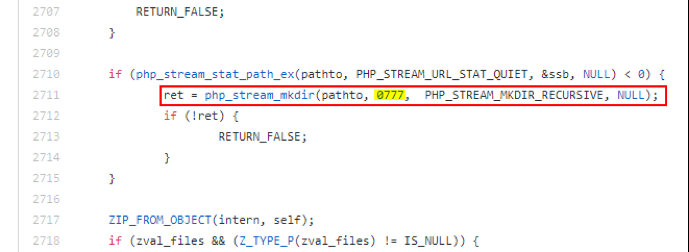
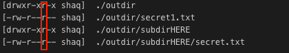
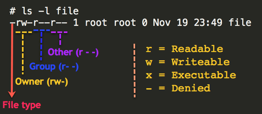
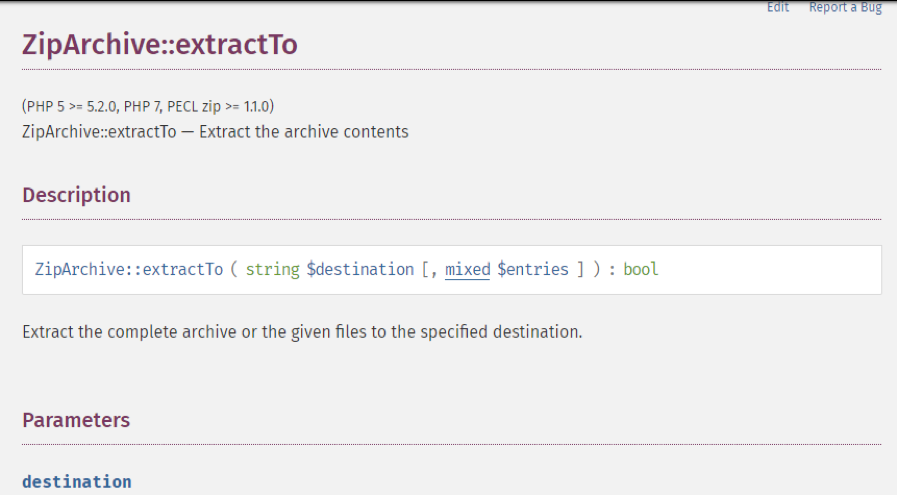
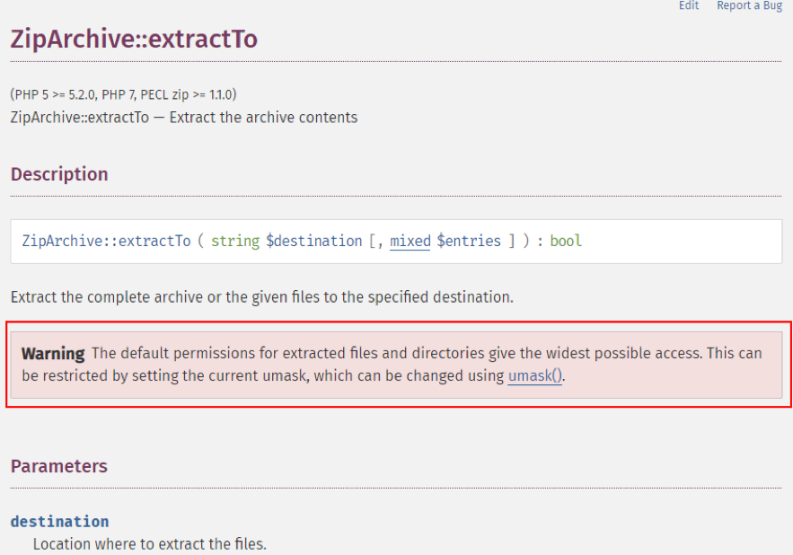

# Digging into ``ZipArchive::extractTo()``
In this post, I will show something that I found in PHP’s source code and affects all versions of PHP. 
During my PHP Internals research, I reviewed the code of ``ZipArchive::extractTo()``, which is responsible for extracting a zip file(opened using ``ZipArchive::open()``) and found an interesting thing.

## Description
Let’s take this example PHP script:
```php
<?php
$zip = new ZipArchive;
if ($zip->open('test.zip') === TRUE) {
    $zip->extractTo('/tmp/phpfuzz/outdir/');
    $zip->close();
    echo 'ok';
} else {
    echo 'failed';
}
?>
```
This script will extract the contents of ``test.zip`` into a directory called “outdir”.

The issue here is that, by default, PHP will create ``outdir/*`` to be with hard-coded 777 permissions:

https://github.com/php/php-src/blob/5fa17fbf94fa95705922313ac0d19e38ddabbad9/ext/zip/php_zip.c#L2781



This is the directory tree after un-zipping the file:



Everything is readable to the public usergroup. And it's recursive (sub-directories are affected as well).

>**Note**: In other systems it can be a "full 777 permission"(like ``rwxrwxrwx``) but on my system it's not due to my *umask* setting (I kept the default setting so you can see a real-life scenario).

## Impact / Threat

This affects mostly applications on shared hosting environments.

On a shared hosting environment, all websites/applications are stored on the same server and each website has its own Linux user & group (this is not correct for all shared hosting providers, but this is the common design that most of the shared-hosting providers prefer to stick with). 
 
 

Making the extracted files & directories readable by the “public” usergroup (in the screenshot above, called “Other”) allows other applications hosted on the same Linux server to read the extracted zip content. This can be easily done using symlinking technique (more about symlinks: https://www.cybrary.it/blog/2019/07/symlink-attacks/)

**Example scenario**:
1.	A PHP application has a feature that's triggering a call to the ``extractTo()`` method. This can happen during plugin installation or any other reason for unpacking zip files.

The files will be extracted to: ``/home/victim/public_html/extracted_here/``

2.	All of the extracted files (which might contain sensitive info such as configurations) are readable to all users on the server. All of the directories are readable too and can be listed by a malicious user on the server.

3.	In order to disclose those extracted files, the attacker buys a basic hosting plan on the same shared-hosting of the target application (or alternatively, take over another vulnerable website that is stored there)

The attacker’s home directory: ``/home/appsec/public_html/``

4.	When the attacker will try to access the victim’s files, he will try the following: 
```
appsec@server:$ ls /home/victim/public_html/
```
This attempt will (most likely) not work because the server is configured properly and the only bypass will be at the OS level.

**However**, if there's a directory/file which is created by ``ZipArchive::extractTo``, it will be readable for everyone on the server.

The attacker runs again the command, but this time he runs the command on a directory created by the ``extractTo`` method:
```
 appsec@server:$ ls /home/victim/public_html/extracted_here/
```
And everything will be listed. The attacker can also run ``cat`` on the files and expose the contents of the files.

A more elegant (and common) way to traverse between the extracted directories that are exposed will be by using a symlink technique.

## Reporting to PHP
I reported this to PHP (bug *#79383* in PHP’s bug tracker) and they said that this is an expected behavior. However, they found out that it is **not documented anywhere.**



As such, they agreed to add a warning (see below) saying that you should use ``umask()`` to prevent from any unnecessary info leakage:
Commit: https://github.com/php/doc-en/commit/c870cfa314d880326cf30cd34b560c94f9526954





