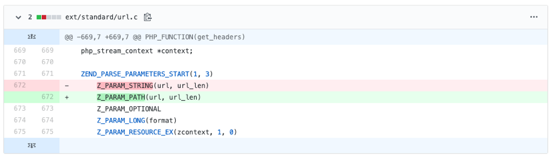

## CVE-2020-7066 – Null byte Poisoning in PHP7

When talking about Null-byte Poisoning in PHP, the most common scenario is file upload / file extension validation bypass (*CVE-2006-7243* and *CVE-2015-2348*). Those kinds of attacks are very rare because we left them in 2006-2015. However, there are other functions which are vulnerable to nullbyte poisoning and didn’t get enough attention / write-ups. The bug that I present here is relevant for all PHP versions as of March 2020.

Let's take this example: The PHP code allows sending requests only to ``.example.com`` subdomains.
```php
<?php
$url = "http://localhost\0.example.com"; // payload

$host = parse_url($url, PHP_URL_HOST);
if (substr($host, -12) !== '.example.com') { // pseudo-validation
    die('Not allowed');
}
$headers = get_headers($url);
print_r($headers);
?>

```

Output:
The request will be sent to http://localhost even though the validation in the ``if`` statement is correct.
```
Array
(
    [0] => HTTP/1.1 200 OK
    [1] => Date: Sun, 22 Mar 2020 21:19:03 GMT
    [2] => Server: Apache/2.4.7 (Unix)
    [3] => Spoofed-Info: isHere
    [4] => Connection: close
    [5] => Content-Type: text/html
)
```

## Root cause
This is the source code of ``get_headers()`` :


At line 672 the parameter is passed from the "php layer"(Zend engine) to the ``char *url`` pointer, and the length of the string is passed to ``size_t url_len`` 

At this point, the string length is **still** 29 bytes long(``http://localhost<NULL>.example.com`` and not ``http://localhost``)

If we debug this and set a breakpoint on ``zif_get_headers()`` we can see that we weren't able to fool Zend Engine. It knows the real length of the string, even with the null-byte injected in it:
```
(gdb) p url_len
$2 = 29
(gdb) x/29bc url
0xb787c100:	104 'h'	116 't'	116 't'	112 'p'	58 ':'	47 '/'	47 '/'	108 'l'
0xb787c108:	111 'o'	99 'c'	97 'a'	108 'l'	104 'h'	111 'o'	115 's'	116 't'
0xb787c110:	0 '\000'	46 '.'	101 'e'	120 'x'	97 'a'	109 'm'	112 'p'	108 'l'
0xb787c118:	101 'e'	46 '.'	99 'c'	111 'o'	109 'm'
```

So, if PHP knows that the length of the string is 29 and not 16, how does this magic work? 

If you look closely, at line 680 (in screenshot above) the ``url`` pointer is passed **but  ``url_len`` is not**. 
When the execution reaches to ``php_stream_open_wrapper_ex()`` it doesn't know the length of the string so like any other typical C program, it will assume that the string ends in the first occurrence of a null byte. 

## The Fix
The git commit: 
https://github.com/php/php-src/commit/2bc92a0cf79e52e2096e45987468740d5bc748ed


The PHP Development Team updated the parameter type to be a ``Z_PARAM_PATH`` (a macro that throws an error if there's a null-byte in the parameter) and not a ``Z_PARAM_STRING`` (which can represent strings with a null-byte in it)

Output:
```
PHP Warning:  get_headers() expects parameter 1 to be a valid path, string given in ...
```


>**Note:** The bug was originally reported by ``64796c6e69 at gmail dot com`` (here: https://bugs.php.net/bug.php?id=79329). I wrote this to share a more in-depth analysis.


