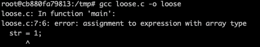
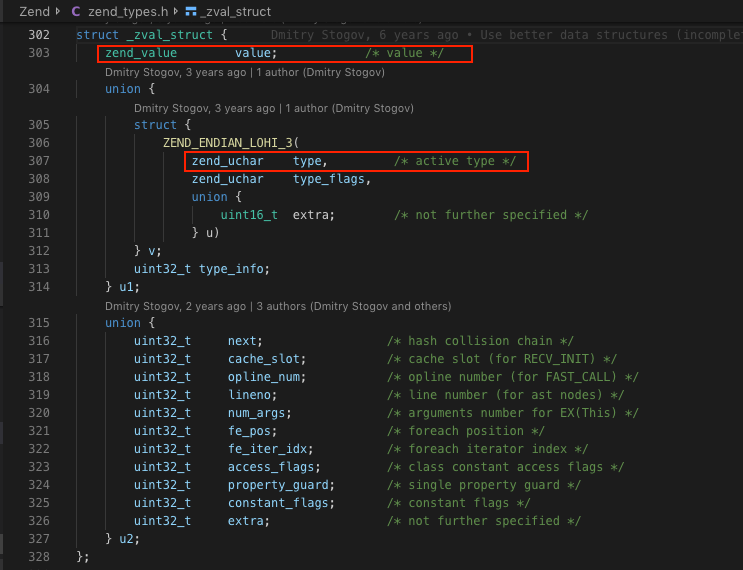
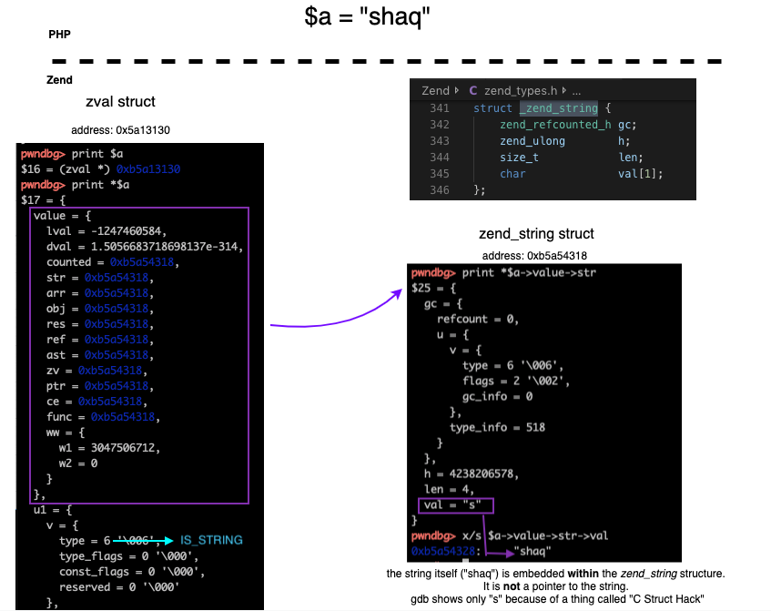
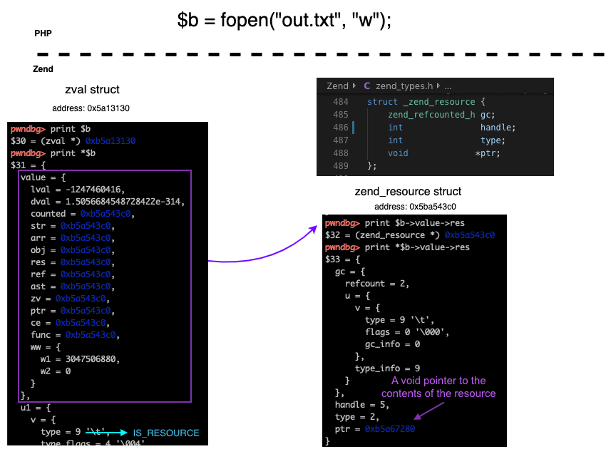
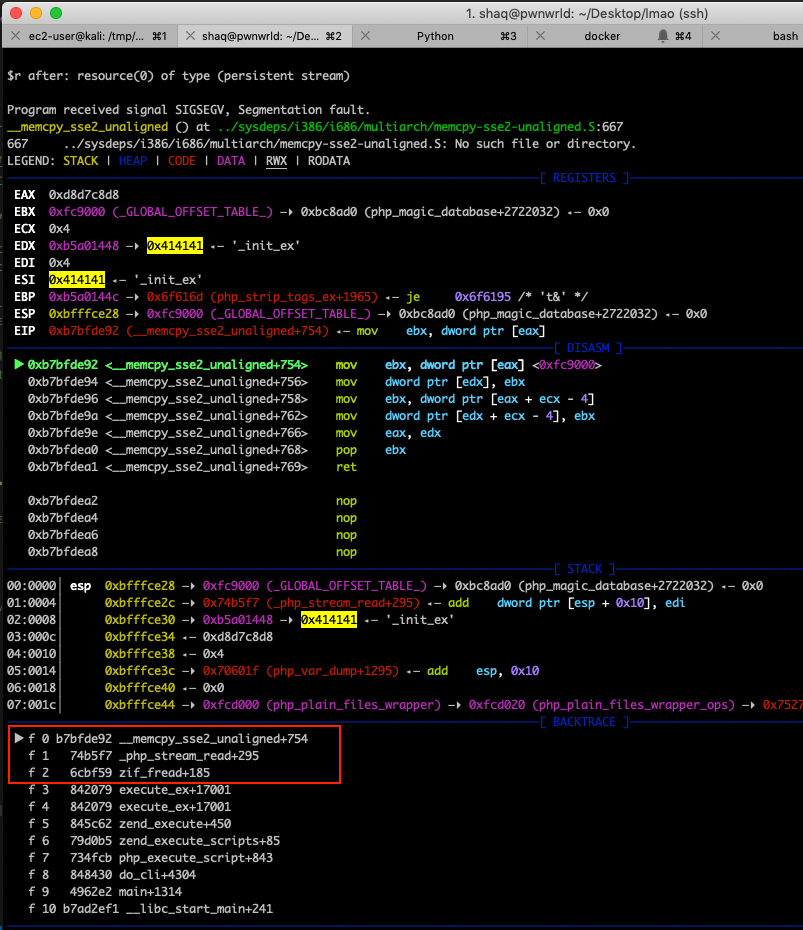
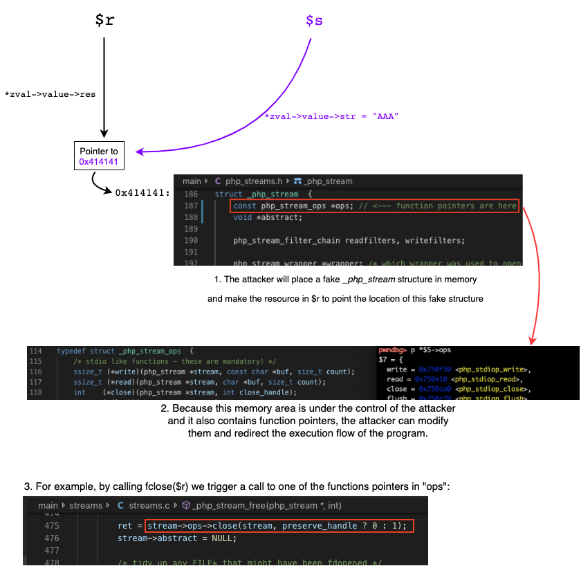

## The bug / CVE-2018-12882

> PHP Version: 7.2 through 7.2.6 (and possibly 7.2.7)

PHP's ``exif_read_data()`` function was found to be vulnerable to *use-after-free*. When supplying an invalid file handle as parameter, the zend engine free's the [resource](https://www.php.net/manual/en/language.types.resource.php) but not unsetting the PHP variable, which causes the variable to be a "dangling pointer" to a free memory area. This is a classic use-after-free case. Our exploit should look something like this:

```php
<?php
$r = fopen(......); // this will be an invalid handle
exif_read_data($a); // triggering an early efree() on the location $a points to in memory
$s = str_repeat('A',4); //this will trigger a call to emalloc() to occupy the free chunk
?>
```
At this point, ``$r`` and ``$s`` share the same memory location but PHP treats them differently ( ``$r``  is a ``zend_resource``, and ``$s`` is a ``zend_string``). 

Because they share the same memory address but have different structures/memory layout: every modification in one of them can cause a memory corruption at the other :D 

But before we continue, you'll have to learn about how PHP variables are represented internally. Keep reading.

## The ``zval``

A ``zval`` (“Zend value”) represents a value in PHP. This is the "container" of a PHP variable. As such it is likely the most important structure in all of PHP and you’ll be working with it a lot. 

If you know basic programming in PHP, you probably noticed that PHP is a loosely typed language.

A loosely typed language such as PHP is a language that does not require you to choose a type for a variable (char, int, float, etc.) **and** it also allows you to change the type of the variable **after** you assigned a value to it. For example: I can create a ``$string`` variable with a string in it, and then change its value to be an integer: 

```php
<?php
$string = "hello!";
$string = 1; // PHP will not throw errors
?>
```
In other languages such as C / C++ / C# if we will try to do something like:
```
char str[] = "hello!"; // create a string / char array
str = 1; // then, treat it like if it was an int variable
```
we will get a type error.




### **"But PHP is written in C, and C is a strongly typed language. How does it make sense?"** 

I'm glad you asked. This is where the ``zval`` comes into the picture. Every variable you create in PHP's "user land" is assigned to a ``zval`` structure:



Don't be afraid, we will focus on the ones in red:

* ``zend_uchar type``: This is where the type of the PHP variable is saved, it is an unsigned char. 
  
  Possible values you will find there: 

```
#define IS_UNDEF					0
#define IS_NULL						1
#define IS_FALSE					2
#define IS_TRUE						3
#define IS_LONG						4
#define IS_DOUBLE					5
#define IS_STRING					6
#define IS_ARRAY					7
#define IS_OBJECT					8
#define IS_RESOURCE					9
#define IS_REFERENCE				10
```
The full list can be found in [Zend/zend_types.h](https://github.com/php/php-src/blob/PHP-7.2/Zend/zend_types.h#L361)

* ``zend_value value``: represents the actual value

This is how it looks like:
```c

typedef union _zend_value {
	zend_long         lval;				/* long value */
	double            dval;				/* double value */
	zend_refcounted  *counted;
	zend_string      *str; // <---- used in this chapter
	zend_array       *arr;
	zend_object      *obj;
	zend_resource    *res; // <---- used in this chapter
	zend_reference   *ref;
	zend_ast_ref     *ast;
	zval             *zv;
	void             *ptr;
	zend_class_entry *ce;
	zend_function    *func;
	struct {
		uint32_t w1;
		uint32_t w2;
	} ww;
} zend_value;
```
>*To those not familiar with the concept of unions: A union defines multiple members of different types, but only one of them can ever be used at a time. E.g. if the ``value.lval`` member was set, then you also need to look up the value using ``value.lval`` and not one of the other members (doing so would violate “strict aliasing” guarantees and lead to undefined behaviour).* **The reason is that unions store all their members at the same memory location and just interpret the value located there differently depending on which member you access**. [[0]](http://www.phpinternalsbook.com/php7/internal_types/zvals/basic_structure.html), 

Remember the last sentence because this is the key to writing the exploit we'll talk about soon. 

Before we'll get to the next part (*Time to pwn*), Let's see how it actually looks in memory because until now, we had only theory stuff.

When running the following PHP script:
```php
<?php
$a = "shaq"; // zval->value will point to a zend_string struct
$b = fopen("out.txt", "w"); // zval->value will point to a zend_resource 
?>
```
The variables will look like this in memory:

``$a``: 



``$b``:



FOR NOW: Ignore everything that is inside the ``gc`` member (it appears in the beginning of a ``zend_string`` and also at the beginning of ``zend_resource``), this thing is related to the garbage collector. We will talk about it in the next chapter.

## Time to pwn


This UAF caught my attention so I thought it will be a good practice if I come up with a practical PoC. 

After digging a while in PHP's structures, I found out a creative **and super easy** way of exploiting it in 32bit systems. This will not work in 64-bit because the whole exploit is based on the fact that ``zend_string`` and ``zend_resource`` structures can land in the same small-bin in the heap (first-fit technique).

```
gdb-peda$ call sizeof(zend_resource)
$8 = 20
gdb-peda$ call sizeof(zend_string)
$9 = 20
```

Run the PoC, read the comments I added there for more information and try to debug it yourself.  I also added some snippets below from my dynamic analysis session. This demonstrates the idea of "two PHP variables of different type share the same memory address" visually:

When you're running ``PoC.php``, PHP sees ``$s`` like that:
```
gdb-peda$ print (zend_string)*0xb5a01408 
$4 = {
  gc = {
    refcount = 1, 
    u = {
      v = {
        type = 6 '\006', 
        flags = 0 '\000',
        gc_info = 0
      },
      type_info = 6
    }
  },
  h = 0,
  len = 3, 
  val = "AAA" <---- our allocated string
}
```

And this is how PHP sees ``$r``:
```
gdb-peda$ print (zend_resource)*0xb5a01408 <---- same address, different structure representation
$5 = {
  gc = {
    refcount = 1,
    u = {
      v = {
        type = 6 '\006',
        flags = 0 '\000',
        gc_info = 0
      },
      type_info = 6
    }
  },
  handle = 0,
  type = 3,
  ptr = 0x414141 <------ what?
}
```
By modifying ``$s`` you can make ``$r`` to point to a fake ``php_stream`` of your own and use ``fread()`` /``fclose()`` to achieve Code Execution in "Zend land" :gun: 

When we try to ``fread($r)`` we get our favorite type of SIGSEVs, PHP tries to read from a ``php_stream`` structure at ``0x414141``:




## The fix
Instead of free'ing the resource, the Zend engine just set it to ``NULL``:

http://git.php.net/?p=php-src.git;a=blobdiff;f=ext/exif/exif.c;h=67e827b44147ab121d1f7174eab62addd24bc889;hp=f5b0d4009fe18daf931a2a073882dc517a560012;hb=3fdde65617e9f954e2c964768aac8831005497e5;hpb=e0290192752a72b5be35b033b33590e040d60d24
```
--- a/ext/exif/exif.c
+++ b/ext/exif/exif.c
@@ -4324,7 +4324,7 @@ static int exif_read_from_impl(image_info_type *ImageInfo, php_stream *stream, i
                        zend_string *base;
                        if ((st.st_mode & S_IFMT) != S_IFREG) {
                                exif_error_docref(NULL EXIFERR_CC, ImageInfo, E_WARNING, "Not a file");
-                               php_stream_close(ImageInfo->infile);
+                               ImageInfo->infile = NULL;
                                return FALSE;
                        }
```

## How the full RCE exploit should look like

Since this is the first time I present heap exploitation in this series, I'd like to keep it simple and not jump straight to a fully-weaponized heap exploits. Simply because at this point, you still don't know enough about PHP's heap. This knowledge is required if you want to do stuff like defeating ASLR and write your malicious data in the right places (will be covered next).

**But if you're curious** (because I know you are):

You can takeover EIP by forging metadata within the ``php_stream`` structure: There's a property called ``ops`` (in ``php_stream``) which is responsible for storing function pointers. Those function pointers can be triggered using PHP functions like ``fread()`` or ``fclose()``:




## What we covered in this chapter
So far, we have: 
* Implemented a classic **first-fit** technique for our exploit without knowing too much about PHP's heap. We caused an early free and made the next allocation of a string to land in the same small bin.
* We learned about the ``zval`` - which is super important for the next bugs.
* We also learned about how some types are represented internally within PHP (``zend_string`` and ``zend_resource`` structures)
* We saw how the modification of one variable can cause a memory corruption at the other when they are sharing the same memory address.
  
This is very cool. But for a real exploit (like the one in *How the full RCE exploit should look like*) we'll need to understand more about the allocator and PHP's heap. This will be covered in the next bug (if you followed the Table of Contents in the main README file, the next bug is ``[CVE-2016-3132] Double-Free to RCE``).

## More info
* The original bug report: https://hackerone.com/reports/371135
* More about ``zval``s: https://www.php.net/manual/en/internals2.variables.intro.php
* My setup:
```
 ./configure --enable-debug=true --enable-cli --enable-exif
 make
```


