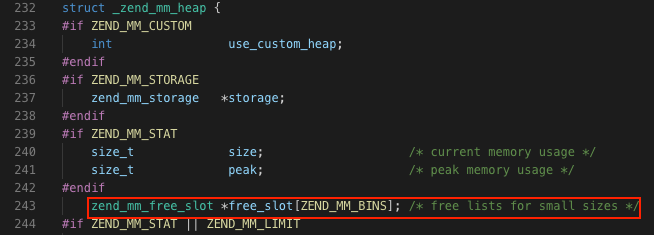
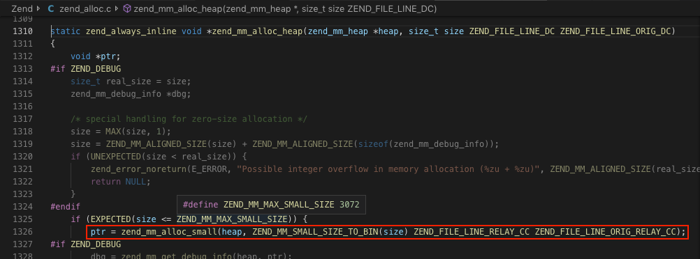
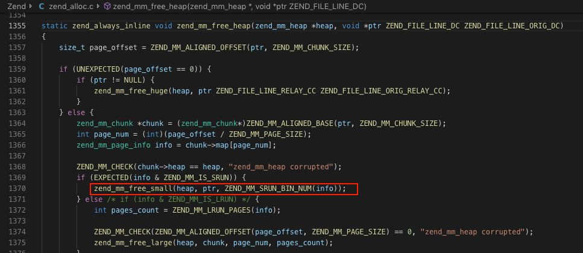
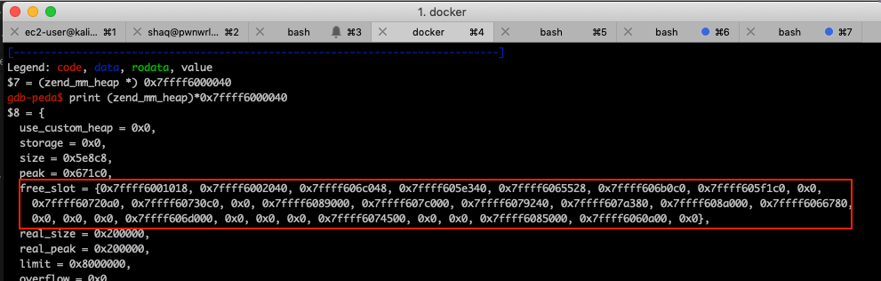
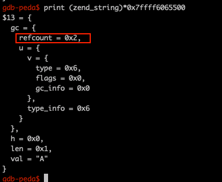
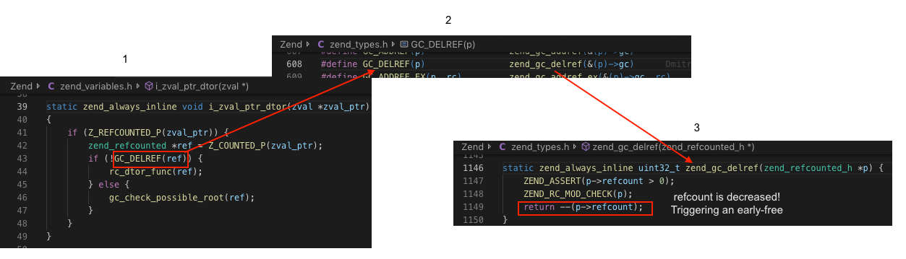
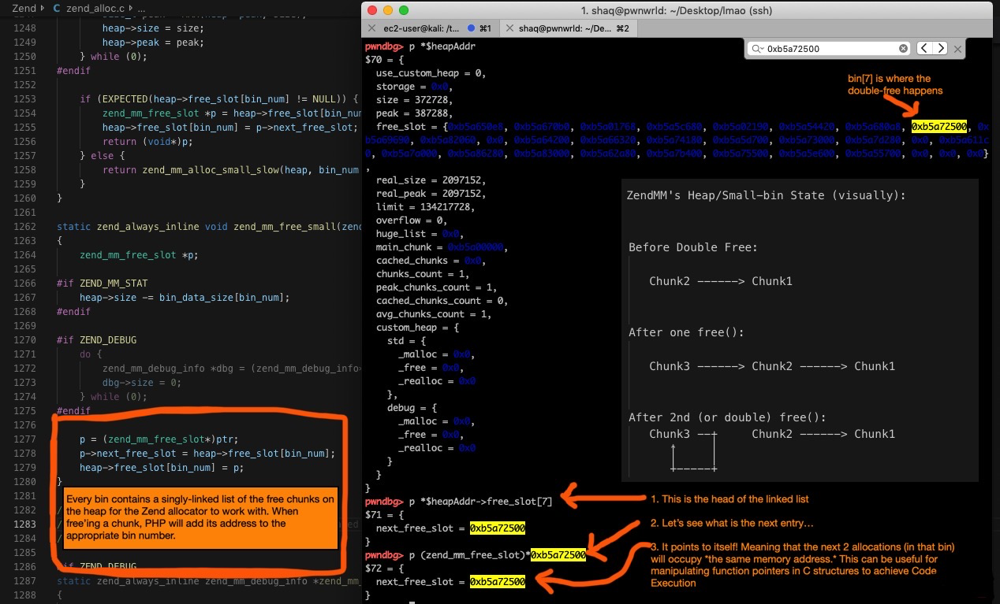
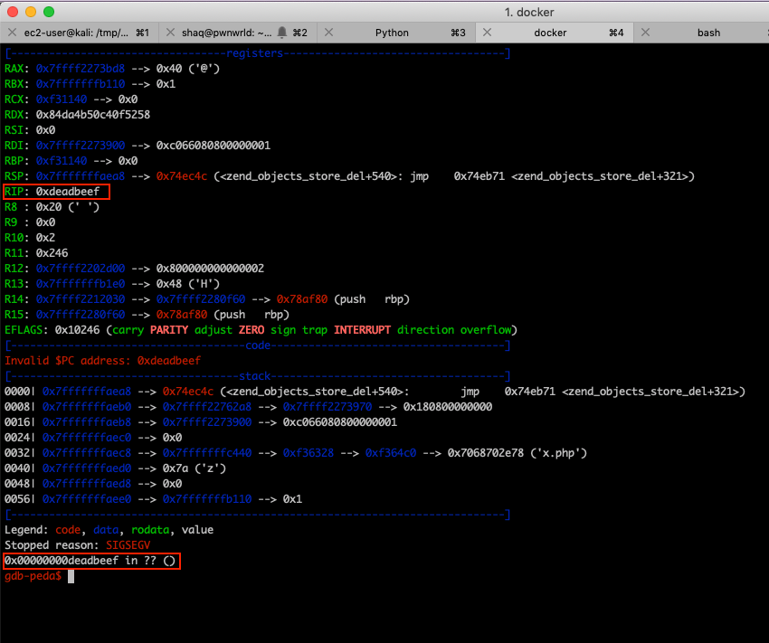

# [CVE-2016-3132] Double-Free to RCE

In the previous chapter, we learned about the ``zval`` & some structures in PHP to get a basic idea on how UAF exploits **should** look like. We also implemented a first-fit technique without knowing anything about PHP's heap.

In this chapter, we'll dive a little bit deeper. We will learn about some new concepts to get the bigger picture:
* The Zend allocator
* The Garbage Collector

After we will cover those subjects, we will see the bug details & technique used to practically exploit it. We will also get to see how PHP objects looks like in memory.

## The Zend Allocator

If you know ``malloc()`` and ``free()`` it should be fairly easy for you to understand. 

The Zend Engine has a custom memory allocator that manages its own heap. Every time PHP wants to allocate a new chunk on the heap, it uses a function called ``emalloc()``. And everytime PHP wants to free a chunk it uses ``efree()``. 

Allocations on the heap are divided into three categories:
* Small heap allocation (< 3072 bytes)
* Large heap allocation ( < 2 megabytes)
* Huge heap allocation ( > 2 megabytes)

We will focus on small heap allocations since this is more common in PHP exploitation.

For heap/UAF exploit development, you will need to know where PHP saves its free memory slots, you can get this information using the ``_zend_mm_heap`` struct, this structure represents the heap:

Snippet from [Zend/zend_alloc.c @ L232](https://github.com/php/php-src/blob/PHP-7.4.2/Zend/zend_alloc.c#L232)

 

Let's focus on the ``free_slot`` property:
* This is an array of pointers.
* Each element in this array represents a head of a singly-linked list, containing the next free chunks.
* There are total of ``ZEND_MM_BINS`` lists (or in other words, bins/free-lists).
* The difference between each bin is the size of the free chunk:
   - ``heap->free_slot[0]`` contains a singly-linked list of pointers to free chunks with **size of 1 - 8 bytes**
   - ``heap->free_slot[1]`` contains a singly-linked list of pointers to free chunks with **size of 9 - 16 bytes**
   - ``heap->free_slot[2]`` contains a singly-linked list of pointers to free chunks with **size of 17 - 24 bytes**
   - ``heap->free_slot[N]`` contains a singly-linked list of pointers to free chunks with **size from ``((N*8)+1)`` to ``((N+1)*8)`` bytes**

### > *What happens during ``emalloc()``?*

When a new allocation is made:

1. The algorithm sees what is the requested size and calculate the appropriate bin number (using the macro ``ZEND_MM_SMALL_SIZE_TO_BIN``):

 

2. When it finds the right bin, it removes one pointer from the free-list and return it back to the user  using ``zend_mm_alloc_small()``:
  
Snippet from [Zend/zend_alloc.c @ L1254](https://github.com/php/php-src/blob/PHP-7.4.2/Zend/zend_alloc.c#L1254)
```c
zend_mm_free_slot *p = heap->free_slot[bin_num];
heap->free_slot[bin_num] = p->next_free_slot;
return (void*)p;
```


### > *What happens during ``efree()``?*

When PHP tries to free a memory chunk:

1. The algorithm sees what is the requested size and calculate the appropriate bin number.

 


2. When it finds the right bin, it adds this pointer to the top of the free-list using ``zend_mm_free_small()``:

Snippet from [Zend/zend_alloc.c @ L1277](https://github.com/php/php-src/blob/PHP-7.4.2/Zend/zend_alloc.c#L1277)

```c
p = (zend_mm_free_slot*)ptr;
p->next_free_slot = heap->free_slot[bin_num];
heap->free_slot[bin_num] = p;
```

### > *How it looks like from PHP's "User Land"*

Pretty straight forward:
```php
<?php
$a = str_repeat('A',4); 
unset($a);
?>
```
* The first line will trigger an ``emalloc()``, requesting to allocate a new ``zend_string`` structure and assign it to our ``zval.value.str`` pointer, which is ``$a``'s value.
* The second line will free the ``zend_string`` **and** set the ``zval`` type to be ``IS_UNDEF``

### > *Can I see it live in a debugger?*

To inspect the heap and the bins, you can:
1. Set a breakpoint on any internal PHP function you'd like.
2. Call ``zend_mm_get_heap()``, this will return the address of the heap:

```
gdb-peda$ call zend_mm_get_heap()
$7 = (zend_mm_heap *) 0x7ffff6000040
```

3. Now, when you have the heap address, you can observe its behaviour more closely when you learn about UAF bugs:

 

Here are our free-lists :D


More resources:
* A great summary to watch before you continue to the next topic: (see from 28:25 to 31:05) https://youtu.be/_Zj0B4D4TYc?t=1705
* The PHP Lifecycle: http://www.phpinternalsbook.com/php7/extensions_design/php_lifecycle.html
* More about Zend Memory Manager (``emalloc`` **is not the only function** for requesting allocations. But it's the most common and this is why I chose to write about it. This link covers more types of allocations such as *persistent allocations* which is done using another function called ``pemalloc()``): http://www.phpinternalsbook.com/php7/memory_management/zend_memory_manager.html


## The Garbage Collector & Reference Counting

Even if you don't call [unset()](https://www.php.net/manual/en/function.unset.php) manually, PHP will know when to free unused variables. But what exactly are "*unused variables*"? How does PHP know when a variable(or, memory chunk) is no longer needed for the rest of the PHP script execution?

The garbage collector decides when to free a chunk, this is done via a strategy called *Reference Counting*:
>*Reference counting garbage collection is where each object has a count of the number of references to it. Garbage is identified by having a reference count of zero. An object's reference count is incremented when a reference to it is created, and decremented when a reference is destroyed. When the count reaches zero, the object's memory is reclaimed* [[Wikipedia]](https://en.wikipedia.org/wiki/Garbage_collection_(computer_science)#:~:text=Reference%20counting,-Main%20article%3A%20Reference&text=Reference%20counting%20garbage%20collection%20is,when%20a%20reference%20is%20destroyed.)

The way it is implemented in PHP: 
* Each PHP variable(``zval`` container) points to a value (via ``zval.value``)
* This value is reference counted: meaning that if you create 2 PHP variables of type string **with the same value**, PHP will not allocate 2 ``zend_string`` structs. Instead, it will increase the reference counting of the first ``zend_string`` and make the second ``zval.value`` point to the same address.

Let's take this PHP script as an example:
```
<?php
$str = "A";
$str2 = $str;
?>
```

The script above will:
1. Allocate a new ``zval``: $str
2. Allocate **one** ``zend_string`` in the memory(``"A"``) and make the ``zval.value`` of $str to point to it.
3. Create another ``zval``: $str2
4. At this point, PHP will **not** allocate another copy of the string, instead, it will increase the reference counting of the first ``zend_string``(from step 2) and and make the second ``zval.value``(which is $str2) to point to the same place.

This is how the string looks like in memory, with refcount of 2:

 

``$str`` and ``$str2`` are both pointing to this value. This "magic trickery" was introduced in PHP7 to reduce memory usage.

>**Note**: the example I showed above may be on a ``zend_string``, but it's also relevant for many other types as well(``zend_resource``, ``zend_object``, etc.). They all have an embedded ``gc`` struct, containing the ``refcount``.

**"This is boring! How exactly reference counting is relevant for PHP exploitation?":** When the refcount hits 0, the garbage collector will automatically free the chunk! ✨ Abusing this behaviour is perfect for UAF exploiters. Our goal is to zero the refcount before the PHP script ends (hence, causing an *early-free*)

In fact, you already abused the refcount in the previous chapter, **you just don't know it**: 

In the previous chapter, we exploited a UAF with a classic *first-fit* technique without knowing **anything** about the garbage collector & the heap. All we did was finding a struct with a similar size to ``zend_resource``(we used ``zend_string``), assuming it will land on the same bin because they're similar in size(and it worked like a charm!).

By zero-ing the refcount, we managed to free a ``zend_resource`` but also managed to keep the PHP variable (``zval``) "alive", pointing to a free memory. It happened because the Zend Engine performed a call to ``i_zval_ptr_dtor()``, which decreases the refcount of the ``zend_resource`` object in memory:

 

The refcount was hitting 0 and the ``zend_resource`` was free'd by the garbage collector before the PHP script actually finished its execution. #profit

Enough talking about the previous chapter, I did this just to demonstrate how important it is to understand the refcount thing and to show you the bigger picture. 

In order to develop exploits in PHP, you don't have to "master" the garbage collector and know everything about it, but on the other hand: you'll have to be with SOME basic understanding about concepts like reference counting as it is very useful.

For more info about Reference Counting in PHP: 
 * PHP's docs: https://www.php.net/manual/en/features.gc.refcounting-basics.php
 * nikic's blog(project maintainer of PHP): https://nikic.github.io/2015/05/05/Internal-value-representation-in-PHP-7-part-1.html


## The bug 

This is it, you're ready. 

The bug's description:

>Double free vulnerability in the SplDoublyLinkedList::offsetSet function in ext/spl/spl_dllist.c in PHP 7.x before 7.0.6 allows remote attackers to execute arbitrary code via a crafted index.

This bug was originally found by Emmanuel Law, he did a talk about it in *TROOPERScon*, you can watch it here: 

https://www.youtube.com/watch?v=I29FEZn1pw4

He also posted a great technical write-up here: http://www.libnex.org/blog/doublefreeinstandardphplibrarydoublelinklist

If the link to the write-up doesn't work anymore: I created a snapshot in *WaybackMachine* (not all heroes wear capes): https://web.archive.org/web/20200609210419/http://www.libnex.org/blog/doublefreeinstandardphplibrarydoublelinklist


Although the write-up and talk are extermly helpful, I know a lot of people want to see how the vulnerabillity looks like in a dynamic analysis.

I created this image from a dynamic analysis session of ``PoC.php``, it really combines everything that we've learned so far(from here & from the URLs I provided):



>**Side note**: In case you're wondering why the bin here is ``free_slot[7]`` and in the original exploit it's bin #12: This is because this screenshot was taken from a 32bit machine when I first learned about the bug. I tried to create my own version for 32bit (because the original exploit is intended for 64bit). 


## PoC 

The PoC exploit allows you to jump to a ROP gadget to execute your own code in "Zend land":



You can look at ``PoC.php`` and see the comments I added to understand better what's happening under the hood. 

## What's next

Right now you're a ninja, but not a wizard yet. 

The only problem with this RCE exploit is that the offsets to your ROP Gadget might change between PHP installations / distros. 

At the end, our goal is to execute system commands on a hardened environment: We want to get a bash shell even when ``system()`` is disabled (configured by the sysadmin using the ``disable_functions`` directive in the php.ini file)

So instead of taking over the instruction pointer and execute arbitrary code in the "Zend land", we can use another approach: Editing PHP's memory directly to make it trigger a call to ``zif_system()``. This will be covered in the next bug and after you'll learn that: you are officially a certified wizard.


## Some more technical info
* Bug original bug report: https://bugs.php.net/bug.php?id=71735
* The commit / fix of this bug: http://git.php.net/?p=php-src.git;a=blobdiff;f=ext/spl/spl_dllist.c;h=1675c7eaf3a1d5b0a960512c7dd751a2f1d65a09;hp=aa0c6c384071a52daf815d230424bb9e97577e5b;hb=28a6ed9f9a36b9c517e4a8a429baf4dd382fc5d5;hpb=f3309173f916e3c5cf37910975f04310706336b5