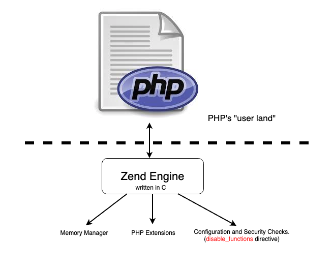
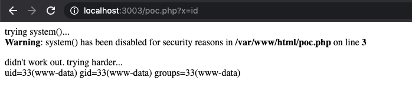

# PHP7 Internals - Become a Wizard
Welcome to the PHP Internals Hub - If you ever wondered about how PHP works internally and how you can exploit it: this is where you should start. 

In this repo, I show basic **and** advanced exploitation in PHP (some of the bugs reported by me). In every "chapter", you'll learn a little bit more about PHP Internals from an infosec perspective.

> IMPORTANT: This repository does not cover explanations about memory corruption bugs. You have to be **somewhat** familiar with bugs like Format String attacks and Basic Heap Exploitation.
>  
> The good news are: you also **don't have to be an expert**. This repo is intended for hackers who solve a lot of crackme challenges but want to step-up their game to a "real-world" binary pwn.

## Table of Contents

 I listed out all the interesting bugs in this repo: from the easiest level all the way to *a certified wizard*

| Level        | CVE / Bug                               | Bug / Description                                                                                  |
|--------------|------------------------------------|----------------------------------------------------------------------------------------------------------|
|  &nbsp; &nbsp; &nbsp; &nbsp; &nbsp; &nbsp; &nbsp; &nbsp; &nbsp; &nbsp; &nbsp; 👶&nbsp;Easy &nbsp;&nbsp;&nbsp; &nbsp;&nbsp; &nbsp;&nbsp; &nbsp;&nbsp; &nbsp;&nbsp;&nbsp;&nbsp; &nbsp;&nbsp;&nbsp; &nbsp;&nbsp;&nbsp;&nbsp; &nbsp;&nbsp;&nbsp; | ``Bug #79383``                     | ``ZipArchive::extractTo()`` extracts files with 777 permissions by default                               |
| 👶 Easy         | ``CVE-2020-7066``                  | Nullbyte poisoning in  ``get_headers()``                                                                 |
| 🧐 Medium         | ``CVE-2020-7067``                  | Out of Bounds Read in  ``urldecode()``                                                                   |
| 🧗 Intermed. | ``/MapServer-CVEs/CVE-2020-10872``   &nbsp;&nbsp;&nbsp;&nbsp;&nbsp;&nbsp;&nbsp;&nbsp;&nbsp;&nbsp;&nbsp;&nbsp;&nbsp;&nbsp;&nbsp;&nbsp;&nbsp;&nbsp;&nbsp;&nbsp;&nbsp;&nbsp;&nbsp;&nbsp;&nbsp;&nbsp;&nbsp;&nbsp;&nbsp;&nbsp;&nbsp;&nbsp;&nbsp;&nbsp;&nbsp;&nbsp;&nbsp;&nbsp;&nbsp;&nbsp;&nbsp;&nbsp;&nbsp; | Classic Stack-Based Buffer Overflow (Not in PHP, but in a PHP extension)                            |
| 🧗 Intermed. | ``/MapServer-CVEs/CVE-2020-10873`` | Format String Vulnerabillity (Not in PHP, but in a PHP extension)                                   |
| 💻 Hacker | ``CVE-2018-12882``                 | Introduction to UAF & basic structures in PHP                              |
| ⚔️ Ninja       | ``CVE-2016-3132``                  | Double-Free vulnerability: In this chapter, you will learn more about the Zend Allocator and how to practically takeover the ``RIP`` register                                                              |
| ✨ Wizard      | ``Bug #76047``                     | In the final chapter, we will see a 0day exploit that was released around Feb 2020 and take a deep-dive into the techniques that the exploit author used in order to trigger a call to ``system()`` |

>**Disclaimer**: This repository is for educational purposes only. Opinions or points of view expressed in this repository represent the view of the
writer, and does not necessarily represent the official position or policies of the PHP project maintainers.
Nothing in this repository constitutes legal advice. All the bugs presented in this repository were fixed.

## Why Should I learn PHP Internals Exploitation?
Learning PHP Internals has a lot more than just remote exploits:
* Some bugs can be exploited by a remote attacker. Like ``unserialize()``, ``mail()``, ``get_headers()`` and more. And in order to really understand them - you'll have to dig into PHP Internals.
* Second thing is: Because the bugs are in the "Zend land", it enables attackers to break any hardened PHP environment (i.e, bypassing ``disable_functions`` and ``open_basedir``.
* If you find memory corruption bugs in Apache, you can trigger those bugs with mod_php and get root shell (since the parent process of apache runs as root), a very cool example is the CARPE DIEM exploit, where @cfreal used a PHP7 0day to trigger a bug he found in Apache's SHM: https://cfreal.github.io/carpe-diem-cve-2019-0211-apache-local-root.html
* Because this is fu\*\*ing cool ok? Who doesn't want to turn into godmode in PHP?

ready to pwn?

## What about unserialize() ?

I didn't include the infamous ``unserialize()`` here because a lot of people did it before me & there's bunch of literature about it. The focus here is more about the runtime of PHP & the Zend Engine. Moreover, if you want to understand ``unserialize()`` you'll have to go through the "beginner's phase" and this is exactly what this repo is about: by learning the bugs above you'll find yourself learning about how variables and objects are stored internally and how the memory in PHP is managed (which is **super** important if you're trying to pwn ``unserialize()``).

Great research material about unserialize: 
* Checkpoint's reearch - Yannay Livneh: 
   - White-paper: https://blog.checkpoint.com/wp-content/uploads/2016/08/Exploiting-PHP-7-unserialize-Report-160829.pdf
   - Talk: https://www.youtube.com/watch?v=_Zj0B4D4TYc
* Black Hat USA Conference(2010) - Stefan Esser (the guy who started this trend of Hacking PHP in the first place)
    - Part 1/5: https://www.youtube.com/watch?v=c0ZCe311YW8
    - Part 2/5: https://www.youtube.com/watch?v=XP6KpKhDlg0
    - Part 3/5: https://www.youtube.com/watch?v=rF9UK4dxtBs
    - Part 4/5: https://www.youtube.com/watch?v=etrxFWlv8_0
    - Part 5/5: https://www.youtube.com/watch?v=fRno4pGlQzw
    - Slides: https://web.archive.org/web/20200116105103/https://www.owasp.org/images/9/9e/Utilizing-Code-Reuse-Or-Return-Oriented-Programming-In-PHP-Application-Exploits.pdf

## Contact

You can find me at [@0x_shaq](https://twitter.com/0x_shaq)